<div align="center">

# P<sup>2</sup>DNet: Panoramic Object Detection via Single Point Supervision

**Point-Supervised Pseudo-BFoV Label Generation for Panoramic Object Detection**

[中文说明](README_zh-CN.md)

</div>

<p align="center">
  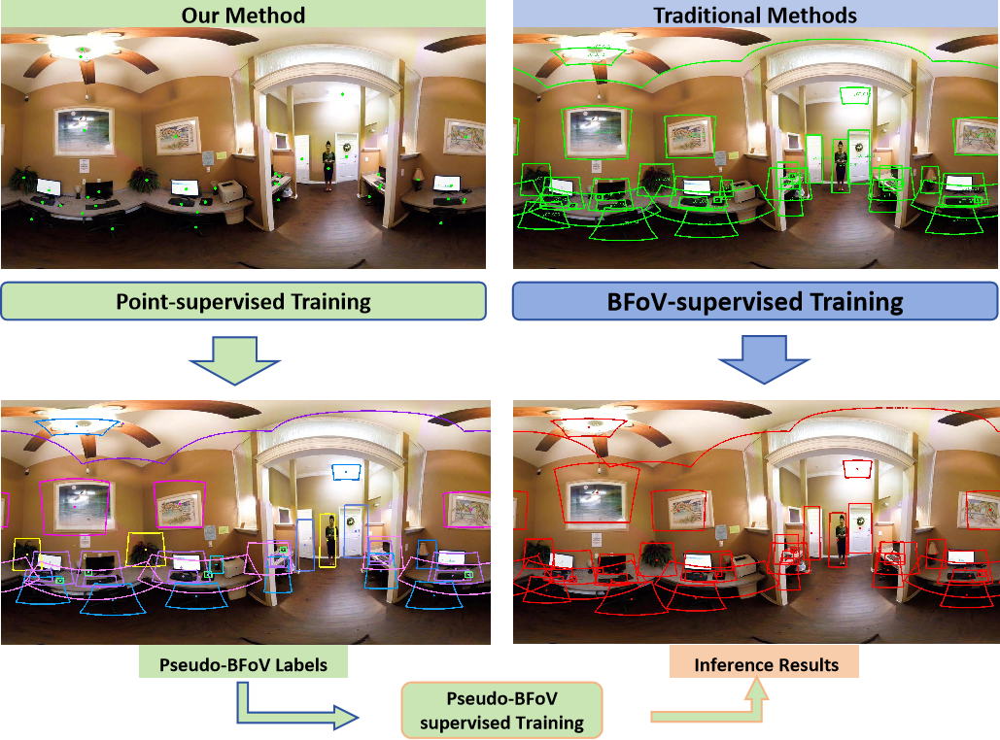
</p>

## Introduction

P<sup>2</sup>DNet is a point-supervised object detection framework designed for ERP panoramic images. It generates pseudo bounding field-of-view labels (pseudo-BFoVs) from sparse point annotations and uses these pseudo labels to train downstream panoramic object detectors, thereby reducing the cost of manually annotating complete BFoVs.

The pseudo-label generation network follows a coarse-to-fine two-stage pipeline:

1. **Coarse FoV Proposal Generation (CFG):** Multi-scale BFoV proposals are generated on the sphere around each point annotation. The proposals are scored through spherical RoI feature extraction and Multiple Instance Learning (MIL), and the high-scoring proposals are then fused through spherical weighted aggregation.
2. **Fine FoV Proposal Refinement (FFR):** Starting from the coarse BFoV, the method progressively refines the pseudo label through four-direction spherical jittering, multi-scale proposal expansion, negative proposal generation, MIL scoring, and spherical weighted aggregation.

## Highlights

- Point-supervised pseudo-BFoV generation for ERP panoramic images.
- Multi-scale BFoV proposal initialization on the sphere.
- Shared-weight original-view and scale-rotated-view branches in the coarse stage.
- Spherical RoI feature extraction based on tangent-plane sampling.
- Top-\(k\) spherical weighted proposal aggregation.
- Four-direction spherical jittering and multi-scale proposal refinement.
- Scale-Rotation Score Consistency Loss (SRC Loss).
- The generated pseudo BFoVs can be used to train panoramic detectors such as Sph-CenterNet.

## Framework

<p align="center">
  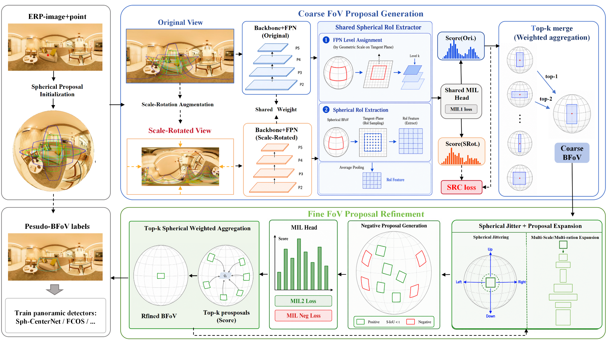
</p>

### Spherical RoI Feature Extraction

The spherical RoI extractor first constructs a dense sampling grid on the local tangent plane corresponding to an RBFoV and then back-projects the sampling points to continuous ERP coordinates. Next, the corresponding FPN level is assigned according to the tangent-plane scale, and the sampled features are aggregated into a fixed-size RoI feature.

<p align="center">
  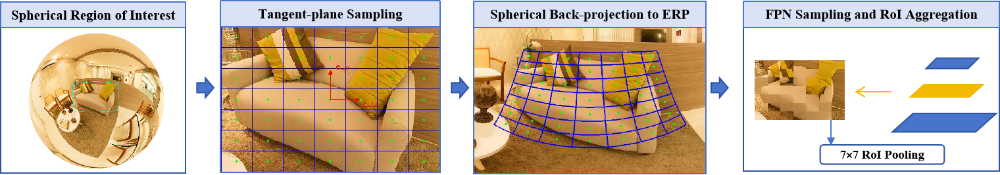
</p>

## Qualitative Results

<table align="center">
  <thead>
    <tr>
      <th align="center">Quasi-GT Point</th>
      <th align="center">GT BFoV</th>
      <th align="center">P<sup>2</sup>DNet (Ours)</th>
      <th align="center">P2BNet-BFoV</th>
    </tr>
  </thead>
  <tbody>
    <tr>
      <td align="center">
        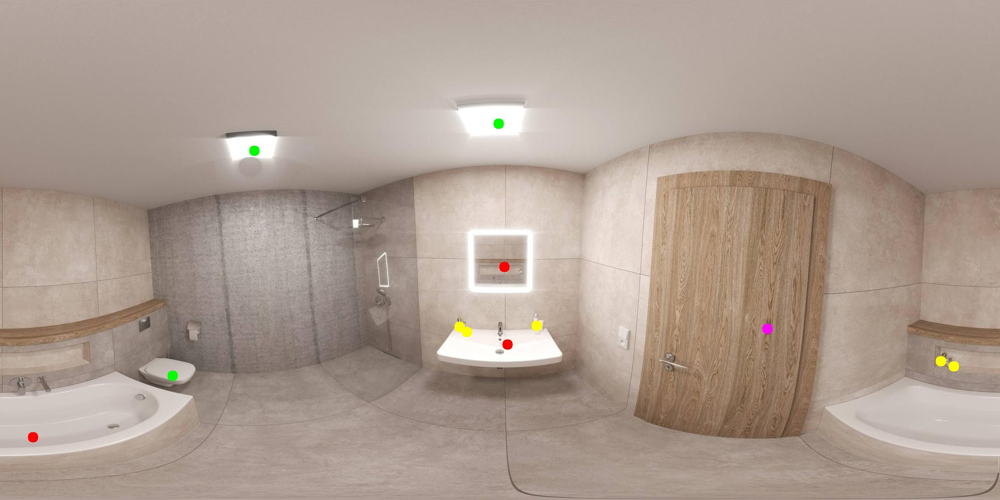
      </td>
      <td align="center">
        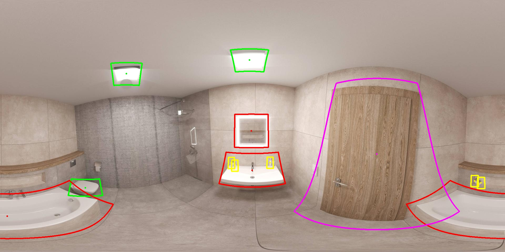
      </td>
      <td align="center">
        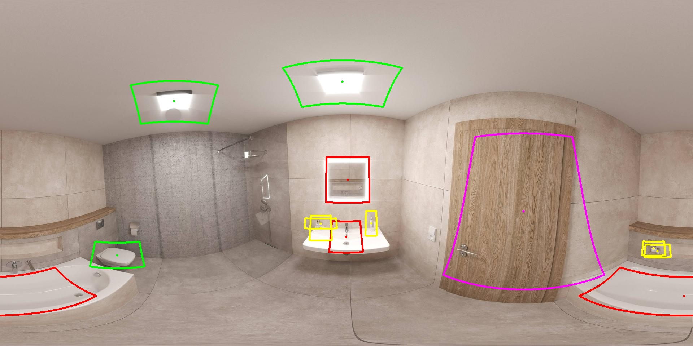
      </td>
      <td align="center">
        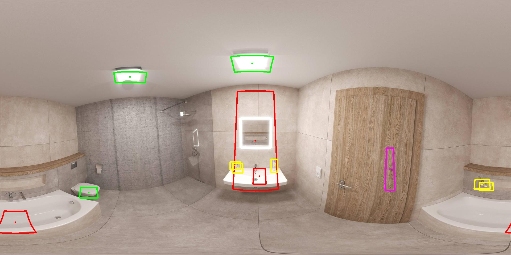
      </td>
    </tr>
    <tr>
      <td align="center">
        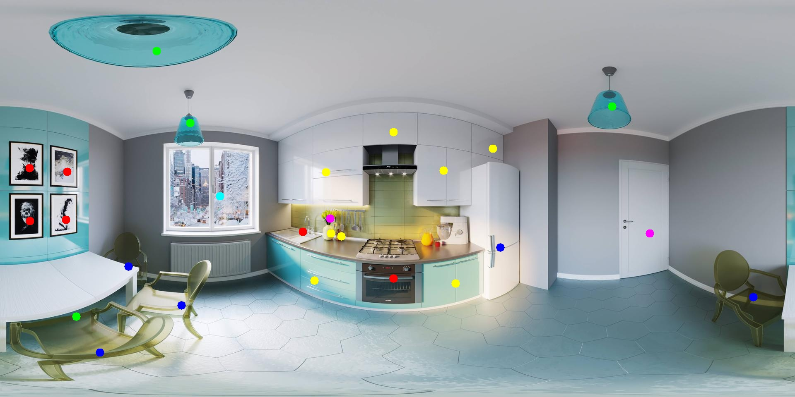
      </td>
      <td align="center">
        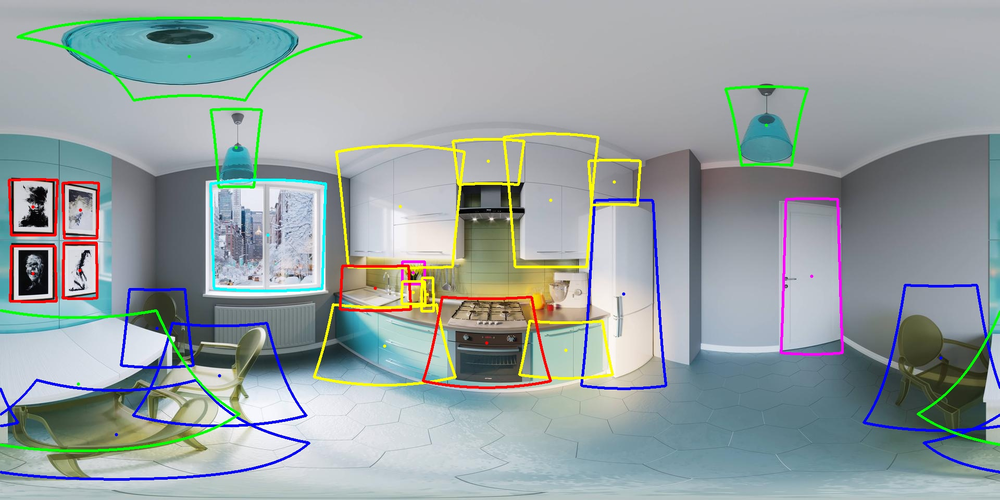
      </td>
      <td align="center">
        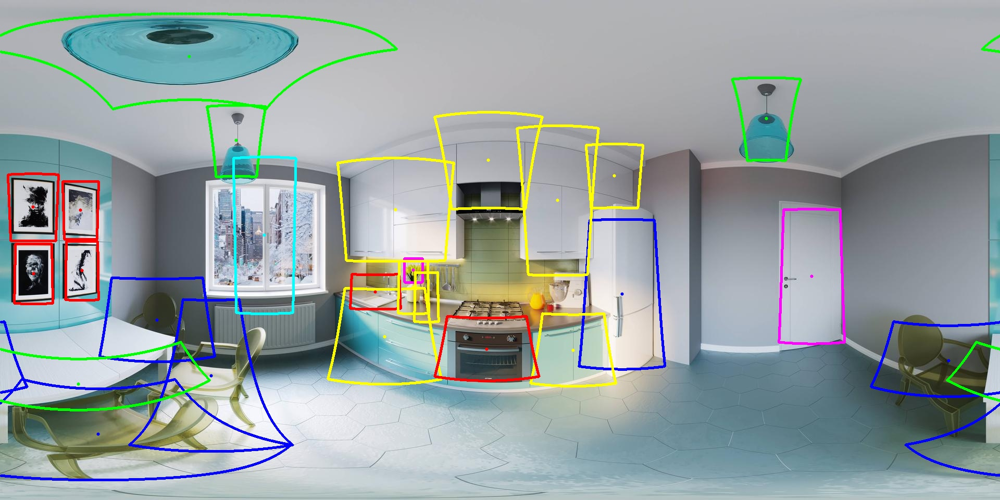
      </td>
      <td align="center">
        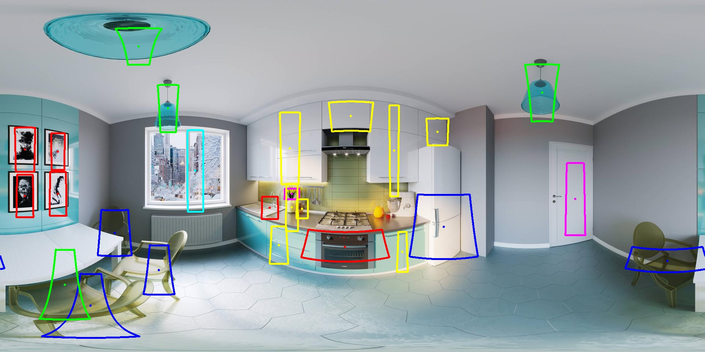
      </td>
    </tr>
    <tr>
      <td align="center">
        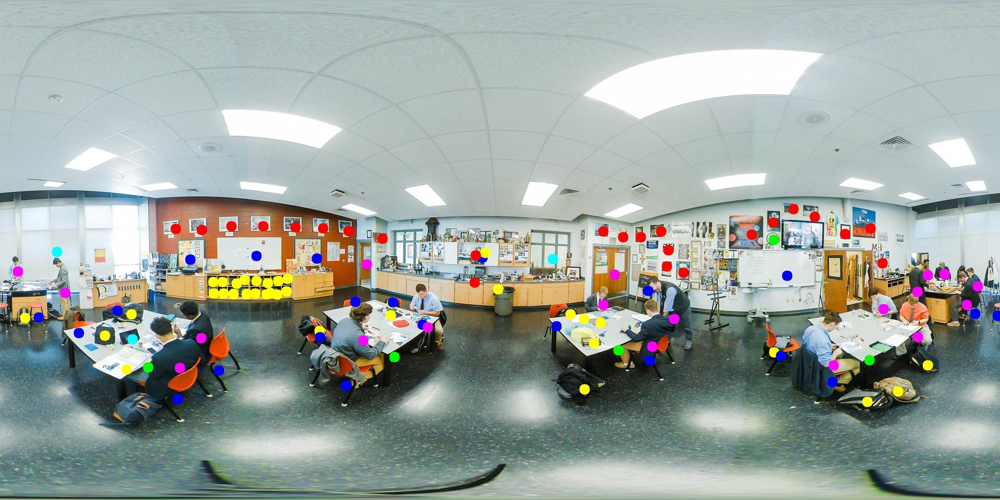
      </td>
      <td align="center">
        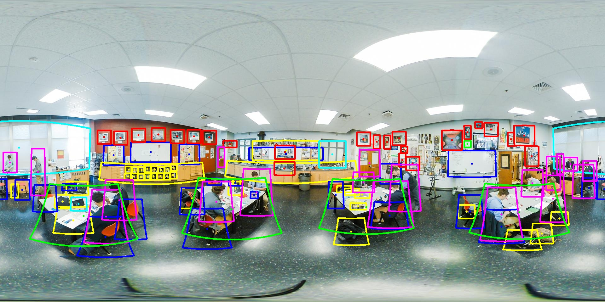
      </td>
      <td align="center">
        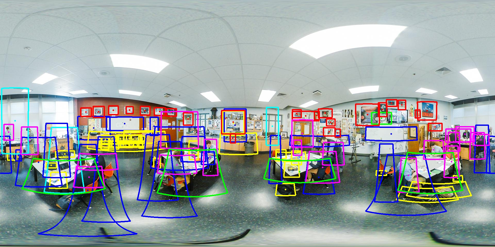
      </td>
      <td align="center">
        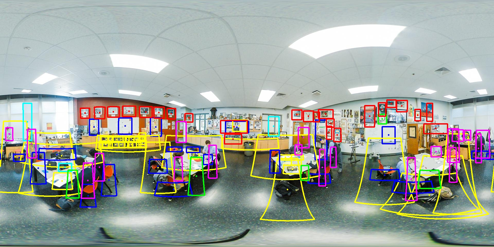
      </td>
    </tr>
  </tbody>
</table>

<p align="center">
  <em>
    Qualitative comparison of quasi-ground-truth point annotations, ground-truth BFoVs,
    pseudo-BFoV labels generated by P<sup>2</sup>DNet, and BFoV results converted from
    the planar point-supervised P2BNet method.
  </em>
</p>

## Main Results

### Pseudo-BFoV Generation Quality on 360-Indoor

| Method | mAP | AP<sub>50</sub> |
|---|---:|---:|
| **P<sup>2</sup>DNet** | **9.56** | **31.04** |
| P2BNet-BFoV | 5.95 | 20.42 |
| PointOBB-BFoV | 4.37 | 17.11 |

### Detection Performance under the Same Annotation Budget

| Supervision and Detector | mAP | AP<sub>50</sub> |
|---|---:|---:|
| Limited Manual BFoVs + Sph-CenterNet | 6.01 | 14.19 |
| **P<sup>2</sup>DNet + Sph-CenterNet** | **7.33** | **18.51** |
| Limited Manual BFoVs + SSD | 4.23 | 11.60 |
| P<sup>2</sup>DNet + SSD | 5.85 | 15.10 |
| Limited Manual BFoVs + FCOS | 2.31 | 6.50 |
| P<sup>2</sup>DNet + FCOS | 4.15 | 9.50 |
| Limited Manual BFoVs + Faster R-CNN | 5.19 | 13.00 |
| P<sup>2</sup>DNet + Faster R-CNN | 6.61 | 16.42 |

## Installation

### 1. Create the Conda Environment

```bash
conda create -n pointobb python=3.7 -y
conda activate pointobb
```

### 2. Install PyTorch

```bash
pip install torch==1.9.0+cu111 \
    torchvision==0.10.0+cu111 \
    torchaudio==0.9.0 \
    -f https://download.pytorch.org/whl/torch_stable.html
```

### 3. Install MMCV

```bash
pip install mmcv-full \
    -f https://download.openmmlab.com/mmcv/dist/cu111/torch1.9.0/index.html
```

Make sure that `mmcv-full` is compatible with the installed PyTorch, CUDA, and MMDetection versions. Do not mix incompatible MMCV 1.x and 2.x APIs in the same environment.

### 4. Install the Project

```bash
# Run the following commands in the repository root.
pip uninstall -y pycocotools
pip install -r requirements/build.txt
pip install -v -e . --user

chmod +x tools/dist_train.sh
```

### 5. Install Additional Dependencies

```bash
conda install scikit-image
# or:
# pip install scikit-image
```

If a formatting-related version error occurs, try:

```bash
pip install yapf==0.40.0
```

## Dataset Preparation

The current experiments use the **360-Indoor** panoramic dataset. The dataset is not redistributed in this repository.

After downloading the dataset:

1. Place the images and annotations in a local data directory.
2. Update `data_root`, the annotation paths, and the image paths in the configuration file.
3. Before training, verify that the ERP images are loaded with the correct width and height.

The main configuration file is:

```text
configs2/COCO/P2BFoV/P2BFoV_r50_fpn_1x_coco_ms.py
```

## Training

### Single-GPU Training

```bash
python tools/train.py \
    configs2/COCO/P2BFoV/P2BFoV_r50_fpn_1x_coco_ms.py \
    --work-dir work_dir/P2BFoV/ \
    --gpu-ids 1
```

### Distributed Training on Two GPUs

```bash
bash tools/dist_train.sh \
    configs2/COCO/P2BFoV/P2BFoV_r50_fpn_1x_coco_ms.py \
    2
```

Specify the visible GPUs explicitly:

```bash
CUDA_VISIBLE_DEVICES=0,1 \
bash tools/dist_train.sh \
    configs2/COCO/P2BFoV/P2BFoV_r50_fpn_1x_coco_ms.py \
    2
```

### Distributed Training on Four GPUs

```bash
CUDA_VISIBLE_DEVICES=0,1,2,3 \
bash tools/dist_train.sh \
    configs2/COCO/P2BFoV/P2BFoV_r50_fpn_1x_coco_ms.py \
    4
```

### Resume Training from a Checkpoint

```bash
CUDA_VISIBLE_DEVICES=0,1 \
bash tools/dist_train.sh \
    configs2/COCO/P2BFoV/P2BFoV_r50_fpn_1x_coco_ms.py \
    2 \
    --work-dir work_dir/P2BFoV/ \
    --resume-from work_dir/P2BFoV/epoch_13.pth
```

## Validation and Inference

### Single-GPU Validation Using the Current Training Entry

```bash
python tools/train.py \
    configs2/COCO/P2BFoV/P2BFoV_r50_fpn_1x_coco_ms.py \
    --work-dir work_dir/P2BFoV/ \
    --gpu-ids 0 \
    --cfg-options \
        load_from=work_dir/P2BFoV/epoch_8.pth \
        runner.max_epochs=0 \
        evaluation.interval=1
```

### Multi-GPU Validation

```bash
CUDA_VISIBLE_DEVICES=0,1 \
bash tools/dist_train.sh \
    configs2/COCO/P2BFoV/P2BFoV_r50_fpn_1x_coco_ms.py \
    2 \
    --work-dir work_dir/P2BFoV/ \
    --cfg-options \
        "load_from=work_dir/P2BFoV/epoch_16.pth" \
        "runner.max_epochs=0" \
        "evaluation.interval=1"
```

## Result Conversion, Visualization, and Evaluation

Convert the output results to COCO-style JSON:

```bash
python bfov/temp_json/bfov2coco/merge_detection_results.py
```

Visualize BFoV results in batches:

```bash
python bfov/temp_json/bfov2coco/bfov_batch_visualization.py
```

Calculate BFoV evaluation metrics:

```bash
python bfov/calculate_bfov_metrics.py
```

Before running these scripts, check their input and output paths and make sure that they point to the current experiment directory.

More detailed training commands and development records are available in:

- [`docs/training_notes.md`](docs/training_notes.md)
- [`docs/experiment_history.md`](docs/experiment_history.md)
- [`docs/BFoVlog_original.md`](docs/BFoVlog_original.md) — original early development log

## Citation

The paper is currently available as a manuscript. Please update the journal, year, DOI, and other publication information after formal publication.

```bibtex
@misc{meng2026p2dnet,
  title        = {P2DNet: Panoramic Object Detection via Single Point Supervision},
  author       = {Meng, Chao },
  year         = {2026},
  note         = {Manuscript}
}
```

## Acknowledgements

This project is built on the MMDetection ecosystem and draws inspiration from related open-source work on point-supervised object detection and spherical panoramic object detection. We thank the authors and maintainers of these projects.

## Contact

For questions about the code or experiments, please contact:

- Chao Meng: `252060202@hdu.edu.cn`
