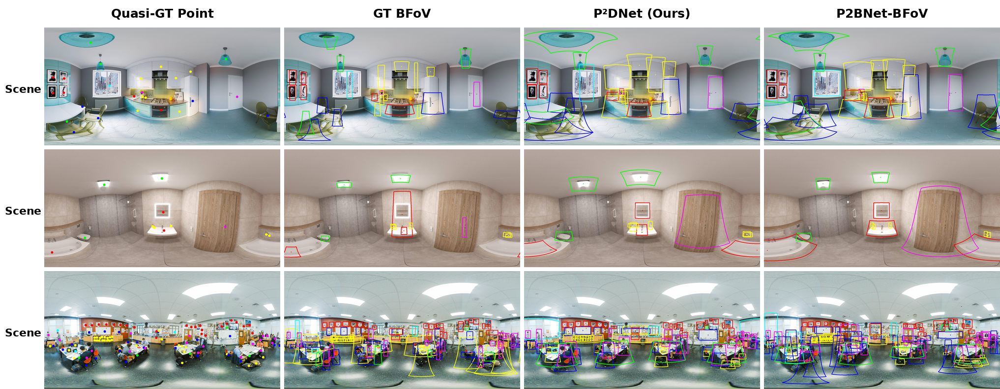

<div align="center">

# P<sup>2</sup>DNet：基于单点监督的全景物体检测

**面向全景物体检测的点监督伪 BFoV 标签生成方法**

[English](README.md)

</div>

<p align="center">
  
</p>

## 项目简介

P<sup>2</sup>DNet 是一个面向 ERP 全景图像的点监督物体检测框架。该方法利用稀疏点标注生成伪边界视场标签（pseudo-BFoV），再使用这些伪标签训练下游全景物体检测器，从而降低人工标注完整 BFoV 的成本。

伪标签生成网络采用由粗到细的两阶段流程：

1. **粗视场提案生成（CFG）**：围绕点标注在球面上生成多尺度 BFoV 提案，通过球面 RoI 特征提取和多实例学习对提案评分，并对高分提案进行球面加权聚合。
2. **精细视场提案优化（FFR）**：以粗 BFoV 为初始结果，通过球面四方向抖动、多尺度扩展、负提案生成、MIL 评分和球面加权聚合逐步优化伪标签。

## 主要特点

- 面向 ERP 全景图像的点监督伪 BFoV 生成。
- 在球面上进行多尺度 BFoV 提案初始化。
- 粗阶段采用原始视图与尺度旋转视图的共享权重分支。
- 基于切平面采样的球面 RoI 特征提取。
- Top-\(k\) 球面加权提案聚合。
- 四方向球面抖动与多尺度提案精修。
- 尺度旋转得分一致性损失（SRC Loss）。
- 生成的伪 BFoV 可用于训练 Sph-CenterNet、SSD、FCOS 和 Faster R-CNN 等全景检测器。

## 方法框架

<p align="center">
  
</p>

### 球面 RoI 特征提取

球面 RoI 提取器首先在 RBFoV 对应的局部切平面上构建密集采样网格，再将采样点反投影到 ERP 连续坐标。随后，根据切平面尺度分配相应的 FPN 特征层，并将采样特征聚合为固定大小的 RoI 特征。

<p align="center">
  
</p>

## 可视化结果

<p align="center">
  
</p>

上图依次展示准真值点标注、真实 BFoV、P<sup>2</sup>DNet 生成的伪 BFoV，以及平面点监督方法转换得到的 BFoV 结果。

## 主要实验结果

### 360-Indoor 上的伪 BFoV 生成质量

| 方法 | mAP | AP<sub>50</sub> |
|---|---:|---:|
| **P<sup>2</sup>DNet** | **9.56** | **31.04** |
| P2BNet-BFoV | 5.95 | 20.42 |
| PointOBB-BFoV | 4.37 | 17.11 |

### 相同标注预算下的检测性能

| 监督方式与检测器 | mAP | AP<sub>50</sub> |
|---|---:|---:|
| 少量人工 BFoV + Sph-CenterNet | 6.01 | 14.19 |
| **P<sup>2</sup>DNet + Sph-CenterNet** | **7.33** | **18.51** |
| 少量人工 BFoV + SSD | 4.23 | 11.60 |
| P<sup>2</sup>DNet + SSD | 5.85 | 15.10 |
| 少量人工 BFoV + FCOS | 2.31 | 6.50 |
| P<sup>2</sup>DNet + FCOS | 4.15 | 9.50 |
| 少量人工 BFoV + Faster R-CNN | 5.19 | 13.00 |
| P<sup>2</sup>DNet + Faster R-CNN | 6.61 | 16.42 |

> 以上数据对应当前论文稿件。发布最终权重和评估协议时，可同步更新结果。

## 环境安装

### 1. 创建 Conda 环境

```bash
conda create -n pointobb python=3.7 -y
conda activate pointobb
```

### 2. 安装 PyTorch

```bash
pip install torch==1.9.0+cu111 \
    torchvision==0.10.0+cu111 \
    torchaudio==0.9.0 \
    -f https://download.pytorch.org/whl/torch_stable.html
```

### 3. 安装 MMCV

```bash
pip install mmcv-full \
    -f https://download.openmmlab.com/mmcv/dist/cu111/torch1.9.0/index.html
```

需要确保 `mmcv-full` 与当前 PyTorch、CUDA 和 MMDetection 版本相互兼容。不要在同一个环境中混用不兼容的 MMCV 1.x 与 2.x 接口。

### 4. 安装项目

```bash
# 在项目根目录执行。
pip uninstall -y pycocotools
pip install -r requirements/build.txt
pip install -v -e . --user

chmod +x tools/dist_train.sh
```

### 5. 安装其他依赖

```bash
conda install scikit-image
# 或：
# pip install scikit-image
```

遇到代码格式化相关的版本报错时，可尝试：

```bash
pip install yapf==0.40.0
```

## 数据集准备

当前实验使用 **360-Indoor** 全景数据集。本项目不直接分发数据集文件。

下载数据集后，需要完成以下操作：

1. 将图像和标注放入本地数据目录。
2. 在配置文件中修改 `data_root`、标注路径和图像路径。
3. 训练前检查 ERP 图像的宽高及读取结果是否正确。

当前主要配置文件为：

```text
configs2/COCO/P2BFoV/P2BFoV_r50_fpn_1x_coco_ms.py
```

## 模型训练

### 单卡训练

```bash
python tools/train.py \
    configs2/COCO/P2BFoV/P2BFoV_r50_fpn_1x_coco_ms.py \
    --work-dir work_dir/P2BFoV/ \
    --gpu-ids 1
```

### 两卡分布式训练

```bash
bash tools/dist_train.sh \
    configs2/COCO/P2BFoV/P2BFoV_r50_fpn_1x_coco_ms.py \
    2
```

显式指定 GPU：

```bash
CUDA_VISIBLE_DEVICES=0,1 \
bash tools/dist_train.sh \
    configs2/COCO/P2BFoV/P2BFoV_r50_fpn_1x_coco_ms.py \
    2
```

### 四卡分布式训练

```bash
CUDA_VISIBLE_DEVICES=0,1,2,3 \
bash tools/dist_train.sh \
    configs2/COCO/P2BFoV/P2BFoV_r50_fpn_1x_coco_ms.py \
    4
```

### 从检查点继续训练

```bash
CUDA_VISIBLE_DEVICES=0,1 \
bash tools/dist_train.sh \
    configs2/COCO/P2BFoV/P2BFoV_r50_fpn_1x_coco_ms.py \
    2 \
    --work-dir work_dir/P2BFoV/ \
    --resume-from work_dir/P2BFoV/epoch_13.pth
```

## 验证与推理

### 使用当前训练入口进行单卡验证

```bash
python tools/train.py \
    configs2/COCO/P2BFoV/P2BFoV_r50_fpn_1x_coco_ms.py \
    --work-dir work_dir/P2BFoV/ \
    --gpu-ids 0 \
    --cfg-options \
        load_from=work_dir/P2BFoV/epoch_8.pth \
        runner.max_epochs=0 \
        evaluation.interval=1
```

### 多卡验证

```bash
CUDA_VISIBLE_DEVICES=0,1 \
bash tools/dist_train.sh \
    configs2/COCO/P2BFoV/P2BFoV_r50_fpn_1x_coco_ms.py \
    2 \
    --work-dir work_dir/P2BFoV/ \
    --cfg-options \
        "load_from=work_dir/P2BFoV/epoch_16.pth" \
        "runner.max_epochs=0" \
        "evaluation.interval=1"
```

## 结果转换、可视化与评估

将输出结果转换为 COCO 风格 JSON：

```bash
python bfov/temp_json/bfov2coco/merge_detection_results.py
```

批量可视化 BFoV 结果：

```bash
python bfov/temp_json/bfov2coco/bfov_batch_visualization.py
```

计算 BFoV 评估指标：

```bash
python bfov/calculate_bfov_metrics.py
```

运行前需要检查这些脚本中的输入输出路径，确保它们指向当前实验目录。

## 实验复现与文件管理

每次训练完成后，至少保存以下文件：

```text
work_dir/<experiment_name>/
├── config.py
├── train.log
├── inference.log
├── checkpoints/
│   ├── epoch_x.pth
│   └── latest.pth
├── predictions/
│   └── results.json
├── visualizations/
└── metrics/
```

建议在实验名称中加入日期、模型版本和核心改动，例如：

```text
2026-06-28_head8_spherical_roi
```

更详细的训练命令和开发记录见：

- [`docs/training_notes.md`](docs/training_notes.md)
- [`docs/experiment_history.md`](docs/experiment_history.md)
- [`docs/BFoVlog_original.md`](docs/BFoVlog_original.md)——早期原始开发日志

## 推荐项目结构

```text
P2DNet/
├── assets/
├── bfov/
├── configs2/
├── docs/
├── mmdet/
├── tools/
├── work_dir/
├── README.md
└── README_zh-CN.md
```

通常应在 `.gitignore` 中排除 `work_dir/`、权重文件、大型预测文件和本地数据集。

## 引用

论文目前仍以稿件形式存在。正式发表后，请更新以下条目中的期刊、年份和 DOI 等信息。

```bibtex
@misc{meng2026p2dnet,
  title        = {P2DNet: Panoramic Object Detection via Single Point Supervision},
  author       = {Meng, Chao and Zhao, Qiang and Zhao, Wenting},
  year         = {2026},
  note         = {Manuscript}
}
```

## 致谢

本项目基于 MMDetection 生态开发，并参考了点监督目标检测和球面全景物体检测方向的相关开源工作。感谢相关项目作者和维护者。

## 联系方式

代码或实验问题可联系：

- 孟超：`252060202@hdu.edu.cn`
- 赵强：`qiangzhao@ieee.org`
